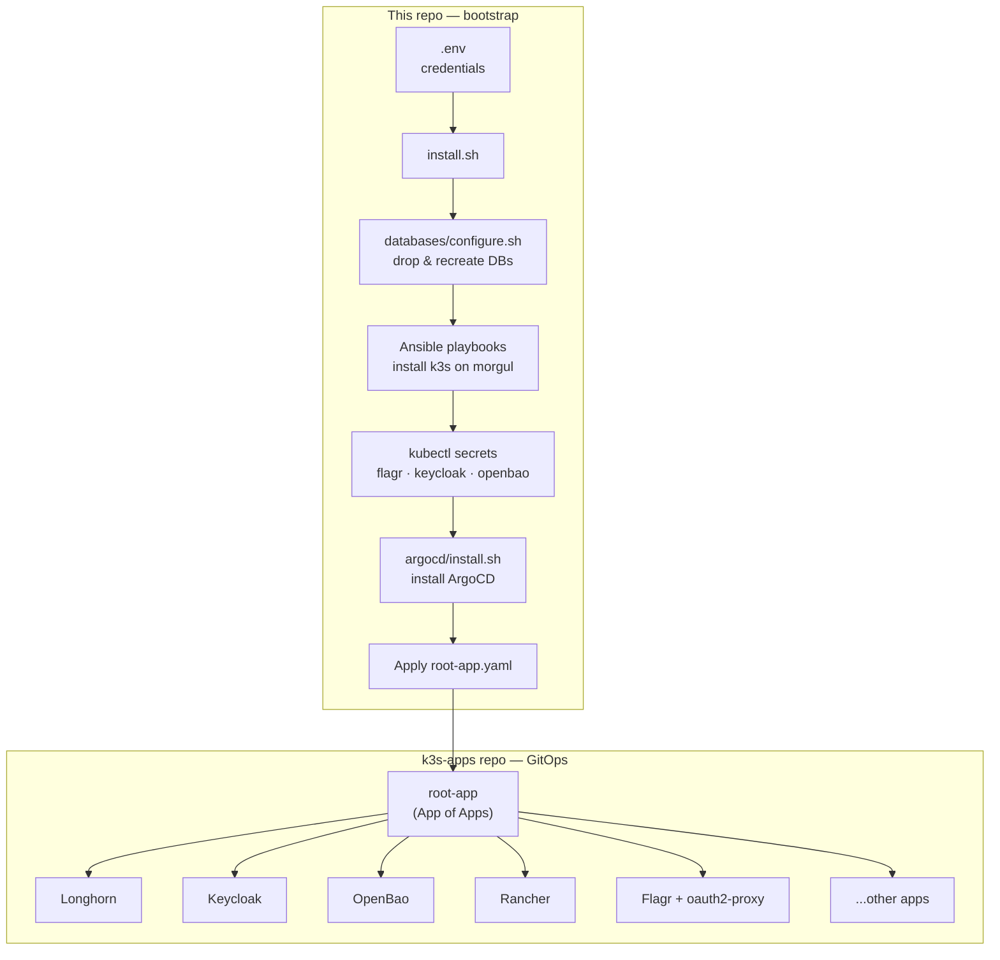
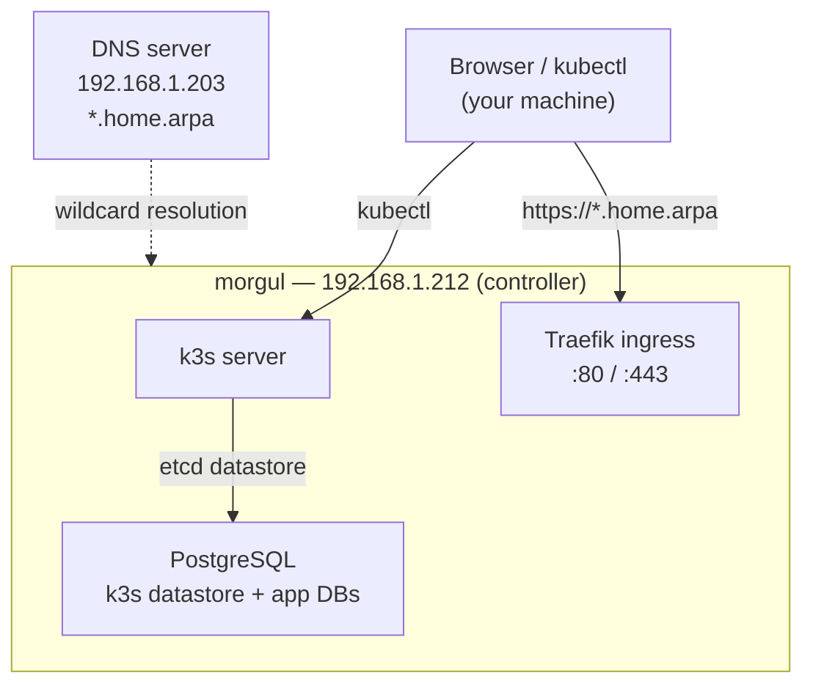

# k3s-experiment

Bootstrap and provisioning scripts for a home k3s Kubernetes cluster. This repo sets up the cluster infrastructure and installs ArgoCD, which then takes over and deploys all applications from a separate GitOps repository ([blogdoft/k3s-apps](https://github.com/blogdoft/k3s-apps)).

## How It Works



**Two repositories, two concerns:**
- **This repo** — provisions the server OS, installs k3s, creates Kubernetes secrets, and installs ArgoCD.
- **[k3s-apps](https://github.com/blogdoft/k3s-apps)** — holds all application Kubernetes manifests. ArgoCD watches it and keeps the cluster in sync. To change a running application, edit that repo, not this one.

## Cluster Topology



k3s uses **PostgreSQL** as its datastore instead of the default embedded etcd. The same Postgres instance also serves Keycloak (`kc-cluster` DB) and Flagr (`flagr` DB).

## Prerequisites

On your **local machine** (the one you run scripts from):

- `ansible` — for provisioning the server OS and k3s
- `kubectl` — configured after k3s install (script copies kubeconfig automatically)
- `argocd` CLI — for registering the apps repository
- `docker` — used by `databases/configure.sh` to run `psql` without a local Postgres install
- `mkcert` — to generate the wildcard TLS certificate for `*.home.arpa`
- `jq` — used by `openbao/init.sh`
- SSH access to `morgul` with sudo

On the **target node** (`morgul`):

- Ubuntu/Debian-based OS with `apt`
- SSH server enabled
- PostgreSQL running and accessible on port 5432
- The `k3s`, `kc-cluster`, and `flagr` databases must exist (or will be created by `databases/configure.sh`)

## Configuration

### 1. Create `.env`

Copy the template below to `.env` in the repo root and fill in your values. This file is gitignored.

```bash
# SSH credentials for Ansible to connect to morgul
ANSIBLE_MORGUL=<your-ssh-user>
ANSIBLE_PASSWORD=<your-ssh-password>

# Hostname/IP of the controller node
HOST_NAME=morgul
DATABASE_HOST=192.168.1.212

# k3s cluster token (choose any random secret string for a fresh install)
K3S_TOKEN=<random-secret>

# PostgreSQL credentials (must match the Postgres instance on morgul)
K3S_DB_USER=<db-user>
K3S_DB_PASSWORD=<db-password>
```

### 2. Edit `inventory.yaml`

The inventory is pre-configured for a single controller (`morgul`). All values are read from `.env` via `lookup("env", ...)` — you only need to change the static values:

```yaml
# inventory.yaml
all:
  vars:
    k3s_bind_address: "192.168.1.212"   # change to your controller IP
    k3s_db_host: "192.168.1.212"        # change to your Postgres host
    ...
controller:
  hosts:
    morgul:
```

To add worker nodes, extend the inventory with a `workers` group and add the corresponding Ansible connection vars for each host.

### 3. Generate the wildcard TLS certificate

This cluster uses a self-signed CA and wildcard certificate for `*.home.arpa`. Generate them with [mkcert](https://github.com/FiloSottile/mkcert):

```bash
mkcert -install
mkcert "*.home.arpa" "home.arpa"
# Produces: _wildcard.home.arpa+1.pem  and  _wildcard.home.arpa+1-key.pem
mv _wildcard.home.arpa+1.pem ingress/
mv _wildcard.home.arpa+1-key.pem ingress/
cp "$(mkcert -CAROOT)/rootCA.pem" ingress/ansible/files/home-arpa-ca.crt
```

The `ingress/install.sh` script distributes the CA to all cluster nodes and stores the cert as Kubernetes secrets (`wildcard-home-arpa`, `traefik-tls-cert`, `traefik-default-cert`).

### 4. Configure DNS

All services resolve to `morgul` (`192.168.1.212`) via a wildcard `*.home.arpa` DNS entry. Point your DNS server or add these entries to `/etc/hosts`:

```
192.168.1.212  argocd.home.arpa
192.168.1.212  longhorn.home.arpa
192.168.1.212  keycloak.home.arpa
192.168.1.212  openbao.home.arpa
192.168.1.212  rancher.home.arpa
192.168.1.212  flagr.home.arpa
```

CoreDNS inside the cluster forwards `home.arpa` queries to `192.168.1.203` (configured in `dns/coredns-custom.yaml`). Change that IP to match your local DNS server.

## Installation

### Step 1 — Prepare the server OS

Run once when setting up a new node. Updates the system, installs required packages, and enables cgroup memory (required for k3s on Raspberry Pi / ARM):

```bash
ansible-playbook playbooks/prepare-server.yaml -i inventory.yaml
```

### Step 2 — Set up TLS certificates

```bash
cd ingress && ./install.sh
```

### Step 3 — Run the full install

```bash
./install.sh
```

The script will:

1. Drop and recreate the `flagr`, `k3s`, and `kc-cluster` PostgreSQL databases
2. Install k3s on `morgul` and copy `~/.kube/config` locally
3. Create secrets for Flagr and Keycloak
4. Patch CoreDNS with the local `home.arpa` forwarder
5. Install ArgoCD and prompt you for your SSH private key to register the `k3s-apps` repo
6. Apply the ArgoCD root app — this deploys Longhorn, Keycloak, OpenBao, Rancher, Flagr, and everything else from `k3s-apps`
7. Pause and ask you to configure Longhorn disk tags at `https://longhorn.home.arpa` (add tag `ssd` to the disk and node)
8. Pause and ask you to unseal OpenBao at `https://openbao.home.arpa`
9. Initialize and unseal OpenBao automatically (saves keys locally to `openbao/openbao-*.txt`, gitignored)
10. Pin Rancher to the `morgul` node
11. Export the CA certificate to `./home-arpa-ca.crt` — import this into your browser to avoid TLS warnings
12. Create the oauth2-proxy secret for Flagr (queries the Keycloak DB for the client secret)

### ArgoCD default credentials

The install script prints the initial admin password at the end. Access at `https://argocd.home.arpa` and change the password on first login.

## Uninstall

```bash
./uninstall.sh
```

Patches Longhorn to allow deletion, then runs the k3s uninstall script on `morgul` via Ansible.

## Services

| Service | URL |
|---------|-----|
| ArgoCD | `https://argocd.home.arpa` |
| Longhorn | `https://longhorn.home.arpa` |
| Keycloak | `https://keycloak.home.arpa` |
| OpenBao | `https://openbao.home.arpa` |
| Rancher | `https://rancher.home.arpa` |
| Flagr | `https://flagr.home.arpa` |

## Re-running Individual Components

Each subdirectory has its own `install.sh` that can be re-run independently:

```bash
cd argocd   && ./install.sh   # reinstall ArgoCD + re-register k3s-apps repo
cd keycloak && ./install.sh   # recreate Keycloak secrets and realm configmaps
cd flagr    && ./install.sh   # recreate Flagr DB secret
cd flagr    && ./postinstall.sh  # recreate oauth2-proxy secret
cd openbao  && POD_NAME=openbao-0 ./init.sh  # re-initialize and unseal OpenBao
```

## Sensitive Files

These are all gitignored. Do not commit them.

| File | Content |
|------|---------|
| `.env` | All credentials and tokens |
| `openbao/openbao-init.json` | OpenBao init response (contains root token + unseal keys) |
| `openbao/openbao-root-token.txt` | OpenBao root token |
| `openbao/openbao-unseal-keys.txt` | OpenBao unseal keys |
| `**/*.pem`, `**/*.key`, `**/*.crt` | TLS certificates and private keys |
